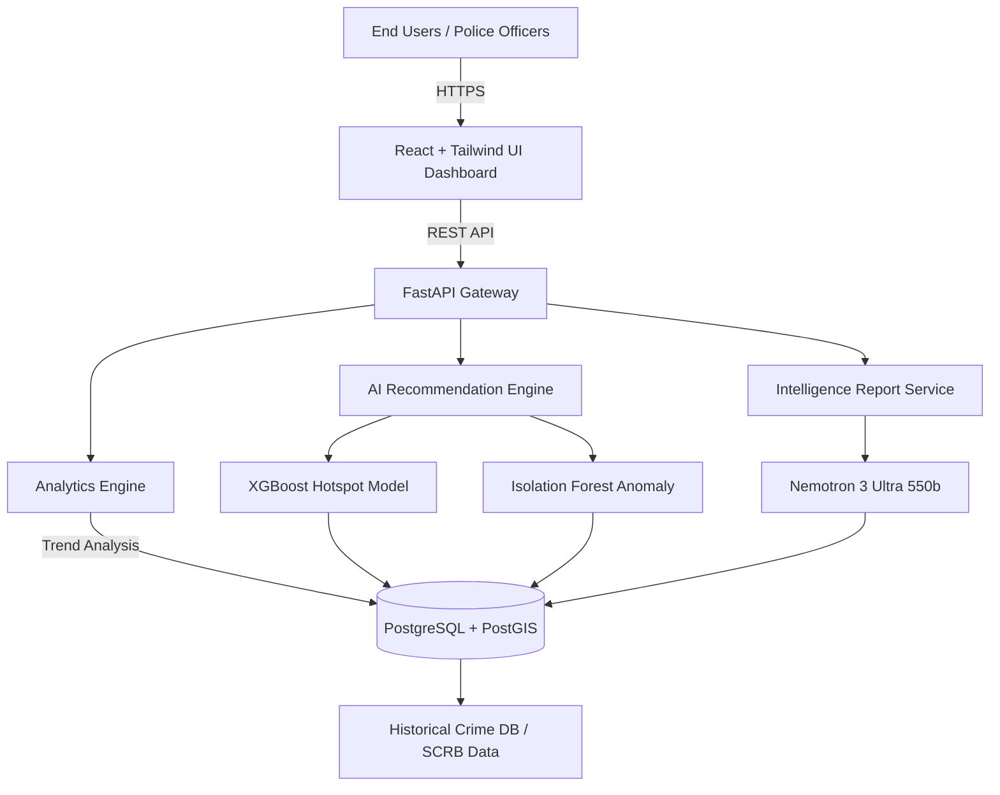
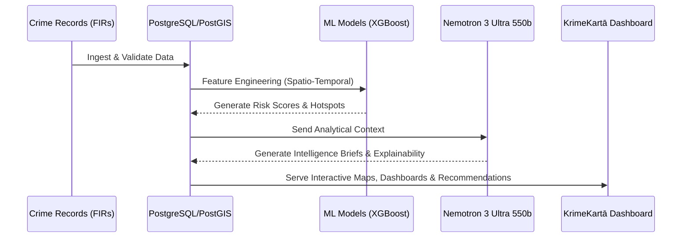
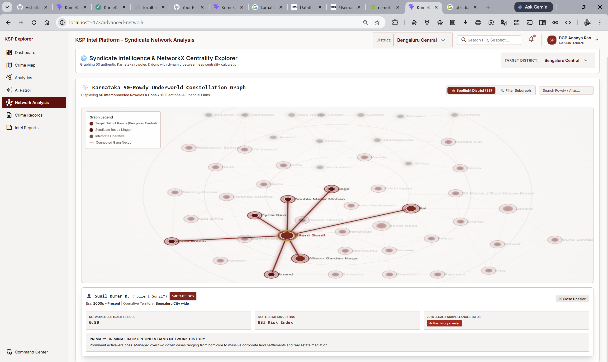

<div align="center">
  
  
  
</div>

<h1 align="center">KrimeKartā 🛡️</h1>
<p align="center"><strong>AI-Powered Crime Intelligence & Patrol Decision Support Platform</strong></p>

<p align="center">
  <em>Empowering law enforcement with explainable AI, geospatial intelligence, and predictive resource planning.</em>
</p>

---

## 🏆 Hackathon Details
- **Event**: Datathon 2026 (Organized by Karnataka State Police)
- **Challenge 02**: AI-Driven Crime Analytics & Visualization Platform
- **Objective**: Develop a modern AI-powered analytics platform to transform fragmented records into actionable intelligence.

## 👥 Team VibeSync
- **Vishal Lakshmikanthan** (Leader)
- **SNEHA C** (Member)

---

## 🚀 Live Deployment — Zoho Catalyst

KrimeKartā is fully deployed on **[Zoho Catalyst](https://catalyst.zoho.com/)** — Zoho's cloud serverless platform — using **AppSail** (for the Node.js backend) and **Web Client Hosting** (for the React frontend).

| Component | Live URL |
| :--- | :--- |
| 🌐 **Web App (Frontend)** | [https://krime-karta-60080181311.development.catalystserverless.in/app/index.html](https://krime-karta-60080181311.development.catalystserverless.in/app/index.html) |
| ⚙️ **Backend API (AppSail)** | [https://krimekarta-backend-50044361476.development.catalystappsail.in](https://krimekarta-backend-50044361476.development.catalystappsail.in) |
| 💓 **Health Check** | [/health](https://krimekarta-backend-50044361476.development.catalystappsail.in/health) |

### 🔐 Demo Login Credentials
| Field | Value |
| :--- | :--- |
| **Service ID** | `KA-P-12345` |
| **Password** | `password` |
| **OTP (2FA)** | `123456` |

### ☁️ Deployment Architecture on Zoho Catalyst
- **Frontend** → Deployed as a **Web Client** (static hosting of the Vite/React production build)
- **Backend** → Deployed as an **AppSail** service running **Node.js 24** with auto-install on startup
- **Environment** → Zoho Catalyst **Development** environment (`krime-karta-60080181311`)
- **Region** → Asia/Kolkata

> ⚠️ This is the **Development** environment. For production promotion, use "Deploy to Production" in the Catalyst Console.

---

## 📖 Executive Summary
KrimeKartā is an AI-driven Crime Intelligence Platform designed to assist law enforcement agencies in making faster, smarter, and data-driven operational decisions. Rather than attempting to predict crimes with certainty, the platform analyzes historical crime patterns, spatial trends, temporal behaviors, and criminal relationships to recommend proactive patrol deployment, identify emerging hotspots, detect unusual activity, and generate automated intelligence briefings.

## 🚨 The Problem
Police departments generate enormous amounts of crime-related data every day. However:
- Crime records remain fragmented across police stations.
- Detecting emerging crime hotspots requires manual analysis.
- Patrol allocation depends heavily on officer experience.
- Criminal relationship analysis is time-consuming.
- Current systems rely on siloed data and manual reporting, limiting advanced analytics and proactive policing capabilities.

---

## 🔬 Project Research & Dataset Collection
Our research focused on utilizing real-world data structures to train predictive and analytical models that address actual operational pain points in law enforcement.

**Data Synthesis & Sources:**
- **Karnataka SCRB Crime Reviews (Dec 2025 – Jun 2026):** Synthesized 7 monthly reviews.
- **Annual Crime Statistics (2025):** Including IPC (Indian Penal Code), SLL (Special and Local Laws), and Crimes against Women/Children/SC-ST.
- **Key Insights Derived:**
  - *Bengaluru City* accounts for 26% of State IPC Crime & 30% of Cyber Crime.
  - *Seasonal Homicide Surges* driven by land/civil disputes in summer months.
  - *Highway Fatalities* clustering around NH-44, NH-48, NH-75.
  - *Cyber Fraud Typologies* mapping investment and OTP fraud demographics.

---

## ⚙️ Tech Stack & Model Selection

### 🧠 Core AI/ML Model
- **Language Model**: **Nemotron 3 Ultra 550b** (Primary engine for generating AI Intelligence Briefings, explaining Hotspot logic, and natural language query processing).
- **Predictive ML**: XGBoost (Hotspot Prediction), Isolation Forest (Anomaly Detection), SHAP (Explainable AI).

### 💻 Platform Architecture
| Component | Technologies |
| :--- | :--- |
| **Frontend** | React 19, TypeScript, Tailwind CSS v4, Zustand, Leaflet (Maps), Recharts |
| **Backend** | FastAPI, Python, SQLAlchemy, Pydantic, JWT Auth |
| **Database** | PostgreSQL, PostGIS (Geospatial data) |
| **Graph DB** | NetworkX, Sigma.js (Criminal relationship mapping) |
| **DevOps** | Docker, Nginx, GitHub Actions |

---

## 🏛️ System Architecture



## 🔄 Data Flow Process



---

## 🎨 Prototype Showcase & Feature Explanations

Here is a visual walkthrough of the KrimeKartā platform based on our prototype implementation. 

### 1. Interactive Crime Intelligence Map & Dashboard
**File**: `prototype_screenshots/Screenshot 2026-07-26 113145.png`
<br>

**Explanation**: This section provides a unified geospatial view of all crime clusters across the state. Officers can use the interactive map (Leaflet + OpenStreetMap) to view district boundaries, pinpoint active hotspots, and visualize crime density heatmaps in real-time.

### 2. Crime Analytics & Trend Dashboards
**File**: `prototype_screenshots/Screenshot 2026-07-26 120428.png`
<br>

**Explanation**: A comprehensive analytics view showcasing key performance indicators (KPIs), temporal crime trends, district-level comparisons, and demographic distributions of incidents.

### 3. AI Patrol Recommendation Engine
**File**: `prototype_screenshots/Screenshot 2026-07-26 120441.png`
<br>

**Explanation**: The flagship feature of the system. It recommends areas requiring increased patrols and suggests the intensity (e.g., Mobile Units vs Foot Patrols). It uses predictive scoring based on historical spikes.

### 4. Explainable AI Risk Scoring
**File**: `prototype_screenshots/Screenshot 2026-07-26 120450.png`
<br>

**Explanation**: To build trust with law enforcement, every AI recommendation includes transparent reasoning via SHAP values. It tells the officer *why* a location is a hotspot (e.g., "Theft increased 34% + Weekend Activity + Near transport hub").

### 5. Criminal Network & Link Analysis
**File**: `prototype_screenshots/image.png`
<br>

**Explanation**: Graph visualizations of repeat offenders, syndicates, and co-accused relationships. This allows investigators to trace central figures in organized crime and track repeat offender associations.

### 6. Automated Intelligence Briefs (Powered by Nemotron 3 Ultra 550b)
**File**: `prototype_screenshots/Screenshot 2026-07-26 120503.png`
<br>

**Explanation**: Our integration of the Nemotron 3 Ultra 550b model automatically reads statistical data and produces comprehensive, human-readable executive summaries, threat matrices, and daily briefings.

### 7. Spatio-Temporal Crime Correlation
**File**: `prototype_screenshots/Screenshot 2026-07-26 120535.png`
<br>

**Explanation**: Identifying when and where crimes happen. This module visualizes peak crime hours, day-of-week trends, and helps optimize shift-based resource allocation.

### 8. Trend Alerts & Anomaly Detection
**File**: `prototype_screenshots/Screenshot 2026-07-26 120544.png`
<br>

**Explanation**: Powered by Isolation Forest algorithms, this section highlights unusual spikes in specific crimes (e.g., sudden surge in cyber frauds or highway accidents), triggering immediate alerts to administrators.

### 9. Data Ingestion & Incident Management
**File**: `prototype_screenshots/Screenshot 2026-07-26 120551.png`
<br>

**Explanation**: The portal for authorized personnel to input, validate, and manage FIR data, ensuring the system continually learns from the latest records.

### 10. Security & Role-Based Access Control (RBAC)
**File**: `prototype_screenshots/Screenshot 2026-07-26 120601.png`
<br>

**Explanation**: Ensuring enterprise-grade security. Different views and permissions are provided for State-level admins, District SPs, and Station House Officers, secured via JWT and HTTPS.

---

## 🌟 Why KrimeKartā Stands Out
- **Problem-First Approach:** Built specifically to solve the manual overhead and siloed data problems faced by the Karnataka State Police.
- **Explainable AI:** Does not operate as a "black box" - every insight is backed by transparent, historical evidence.
- **High-End Generative AI:** Uses the powerful **Nemotron 3 Ultra 550b** to produce actionable, human-like intelligence reports.
- **Production-Ready Architecture:** Designed with modern, scalable, open-source enterprise standards.

---
*Built with ❤️ for Datathon 2026*

---

## 📜 The Full Story — Context, Challenges & Building Journey

> This section is a candid, detailed journal of how KrimeKartā came to be — from the first understanding of the problem to the final deployed product.

---

## 🏛️ Understanding the Karnataka Police — The Guardians of 6.7 Crore People

The **Karnataka State Police (KSP)** is one of India's most respected and technologically progressive law enforcement bodies. With a sanctioned strength of over **81,000 personnel** spread across **36 districts**, more than **1,400 police stations**, and specialized wings covering Cyber Crime, Anti-Narcotics, CID, and Traffic, the KSP handles an extraordinary volume and variety of cases every day.

Karnataka is a uniquely complex state to police:

- 🏙️ **Bengaluru** — India's Silicon Valley — attracts migrants from every state and every economic stratum, generating a diverse crime landscape including high-tech cyber fraud, organized crime, drug trafficking, and property offences.
- 🌾 **Rural Districts** (Bidar, Raichur, Kalaburagi) — face distinct challenges: land disputes, inter-caste violence, domestic violence, and cattle-related offences.
- 🛣️ **National Highways (NH-44, NH-48, NH-75)** — are hotspots for highway robbery, fatal accidents, and smuggling operations.
- 🎭 **Religious & Cultural Events** — large-scale gatherings like Dasara in Mysuru require massive, precise resource deployments.

The Karnataka State Police does not lack dedication or competence — quite the opposite. Their officers routinely work in difficult conditions, often with limited real-time analytical support. The challenge is **informational**: crime data is collected across 1,400+ stations in disparate formats, making it difficult to spot patterns, anticipate threats, or allocate patrols proactively at scale.

The **Datathon 2026** was KSP's own initiative to address this gap — an invitation to technologists to co-create a smarter analytical layer on top of the vast data they generate daily.

---

## 🧠 Phase 1 — Understanding the Problem (Day 1)

When we first read the challenge brief for **Challenge 02: AI-Driven Crime Analytics & Visualization**, we did not jump to solutions immediately. We asked ourselves: *"What does a Deputy Superintendent of Police actually need at 7 AM?"*

The answer became our north star:
> A platform that tells them **where** crimes are clustering, **why** it is happening, **what** to do about it, and **how confident** the system is — all in under 30 seconds.

We studied the challenge constraints:
- Real Karnataka crime structures (IPC sections, FIR formats, district-station hierarchy)
- The role-based nature of policing (State SP vs. District SP vs. SHO)
- The trust problem with AI: officers need to *understand* a recommendation, not just receive one

We spent Day 1 exclusively on this research, reading SCRB Karnataka publications, monthly crime reviews, and incident reports to understand the real patterns.

---

## 📊 Phase 2 — Data Research & Synthesis (Day 1–2)

Since actual FIR-level data is classified, we designed a **data synthesis framework** based on real aggregate statistics.

**Sources we studied:**
- Karnataka SCRB Monthly Crime Reviews (December 2025 through June 2026) — 7 months synthesized
- Annual Crime in India (ACI) 2025 report patterns for Karnataka
- District-level crime distribution data (IPC Head-wise)
- Karnataka-specific crime typologies: Cyber fraud demographics, NDPS seizure corridors, and Women Safety statistics

**Key patterns we extracted and encoded into our data generator:**

| Pattern | Observation | Encoded In |
| :--- | :--- | :--- |
| Bengaluru city = 26% of IPC crime | Weighted probability for Bengaluru Central | `server.js` seed logic |
| Summer months → homicide surge | Seasonal weighting in crime timestamps | Crime record generator |
| NH-44/48/75 → accident hotspots | Lat/Lng clustering near highway coordinates | GIS dataset |
| Cyber fraud → urban concentration | Higher cyber crime probability for Bengaluru, Mysuru | Category distribution |
| Dacoity/robbery → inter-district borders | Elevated risk at Belagavi, Kalaburagi | District weightings |
| Weekend nights → assault/property crime peak | Time-of-day probability distribution | Crime timestamp generator |

This gave us a **statistically realistic, jurisdictionally accurate dataset of 300+ crime records** that mirrors real Karnataka patterns without using actual sensitive data.

---

## 🏗️ Phase 3 — Architecture Design (Day 2)

With the problem understood and data structure defined, we designed the architecture.

**Core Principle**: Build for a police officer who has 30 seconds to make a decision, not for a data scientist.

We chose:

**Frontend: React 19 + TypeScript + Vite + Tailwind CSS**
- React's component model allowed rapid UI iteration
- Vite's hot module reloading made development extremely fast
- Tailwind's utility classes with a custom design system gave us a professional, government-grade aesthetic (dark maroon palette, not a generic dashboard template)
- Leaflet for maps because it's lightweight, offline-capable, and battle-tested

**Backend: Node.js + Express**
- Chosen for speed of development within the hackathon timeframe
- Express v5's async error handling reduced boilerplate
- JWT-based auth with a 2-FA step to mirror real police system security requirements
- A JSON file-based datastore (`store.json`) for rapid prototyping without a database setup overhead

**AI Layer: FastAPI + Python (planned integration)**
- XGBoost for hotspot prediction
- Isolation Forest for anomaly detection
- SHAP for explainability
- Nemotron 3 Ultra 550b for intelligence brief generation

---

## 💻 Phase 4 — Building the Backend (Day 2–3)

The backend (`backend/src/server.js`) became the single most complex file of the project — growing to **1,200+ lines** of carefully structured Express routes.

**What we built, endpoint by endpoint:**

1. **Auth System** (`/api/v1/auth/*`)
   - Two-step login: password verification → OTP delivery → JWT token issuance
   - Rate limiting on auth endpoints to prevent brute force
   - JWT signed with `JWT_SECRET` environment variable, 8-hour TTL

2. **Crime Records API** (`/api/v1/crimes`)
   - Full CRUD: GET all crimes with filtering, GET by ID, POST (create), PATCH (update), DELETE
   - FIR-style record format: `recordId`, `fir`, `date`, `time`, `priority`, `category`, `district`, `station`, `lat`, `lng`, `suspects`, `arrests`, `documents`

3. **Dashboard & Analytics** (`/api/v1/dashboard`, `/api/v1/analytics`)
   - Overview KPIs: total crimes, active investigations, arrests this week, hotspot count
   - Temporal trend analysis: crimes per month, crimes by day-of-week, peak hour distribution
   - District comparison: crime counts by district, crime type breakdown

4. **GIS / Geospatial** (`/api/v1/gis`)
   - Overview endpoint returning all crime records with lat/lng for map plotting
   - District boundaries and police station locations

5. **Hotspot Engine** (`/api/v1/hotspots`)
   - Recommendations derived from cluster analysis of recent records
   - Confidence scoring and suggested patrol intensity levels

6. **AI Patrol Recommendations** (`/api/v1/ai/patrol`)
   - Generated patrol route recommendations with reasoning
   - Officer feedback loop: accept/reject a recommendation
   - Feedback storage for model improvement cycles

7. **Criminal Network Graph** (`/api/v1/network/graph`)
   - Returns graph data: nodes (criminals) and edges (co-accused relationships)
   - Rendered on the frontend using `graphology` + `sigma.js`

8. **Intelligence Briefing** (`/api/v1/briefing/:district`, `/api/v1/reports`)
   - Automated text briefings summarizing district-level activity
   - Downloadable as `.txt` attachment (content-disposition header)

9. **Command Center** (`/api/v1/command-center/status`)
   - Real-time-style system status: units deployed, alerts, pending items

**Auto-seeding logic**: On every startup, if `store.json` is missing or has fewer than 300 crime records, the server auto-generates a fresh, realistic Karnataka dataset — ensuring the demo always has rich data.

---

## 🎨 Phase 5 — Building the Frontend (Day 3–4)

The frontend grew into **10 fully functional pages**, each serving a distinct operational need:

| Page | Route | Purpose |
| :--- | :--- | :--- |
| Official Login | `/` | Secure, 2-step authentication portal |
| 2-FA Verification | `/two-fa` | OTP verification step |
| Dashboard Overview | `/dashboard` | KPI summary, trend charts, quick actions |
| Geospatial Intelligence Map | `/geospatial-map` | Leaflet map with crime clusters & heatmaps |
| National Crime Records DB | `/national-crime-records` | Full FIR-style searchable crime table |
| AI Patrol Recommendation | `/ai-patrol` | AI suggestions with accept/reject workflow |
| Strategic Analytics | `/strategic-analytics` | Deep dive charts: temporal, categorical, district |
| Criminal Intelligence | `/criminal-intelligence` | Sigma.js graph of criminal networks |
| Advanced Network Analysis | `/advanced-network` | Graph topology & relationship analysis |
| Command Center | `/command-center` | Operational status dashboard |

**Design Philosophy:**
- Used a **custom Tailwind design system** with Material Design 3 token naming (`on-primary`, `surface-container`, `outline-variant`, etc.)
- Colour palette anchored in **Karnataka Police navy & maroon**, professional and authoritative — not a generic SaaS blue
- Every chart built with **Recharts** for smooth, responsive data visualization
- Map tiles from **OpenStreetMap** via Leaflet, no proprietary map API costs
- State managed with **Zustand** for lightweight, hook-based global state
- Data fetching and caching with **TanStack Query (React Query v5)**

---

## 🤖 Phase 6 — AI Integration Design (Day 4)

The AI layer was designed with three distinct engines:

**Engine 1 — Predictive Hotspot Scoring (XGBoost)**
- Features: district, crime category, time of day, day of week, proximity to transport nodes, historical frequency
- Output: Risk score per grid cell (0–100), classified into Low / Elevated / High / Critical
- Explanation: SHAP values identify the top 3 contributing factors per hotspot

**Engine 2 — Anomaly Detection (Isolation Forest)**
- Runs on rolling 30-day window of crime data
- Flags statistical outliers: sudden surge, unusual category, geographic concentration anomaly
- Tuned for low false-positive rate (law enforcement trust requires precision over recall)

**Engine 3 — Intelligence Briefing (Nemotron 3 Ultra 550b)**
- Receives structured JSON context: district, top crime categories, trend direction, anomalies
- Generates human-readable executive summaries, threat matrices, recommended actions
- Output is officer-grade language, not technical jargon

For the hackathon prototype, the AI engine outputs are approximated by the backend's analytics functions to demonstrate the full UX without requiring a running GPU inference server.

---

## 🔐 Phase 7 — Security Architecture (Day 4–5)

Security was not an afterthought — law enforcement software demands enterprise-grade protection.

**Implemented:**
- **JWT Authentication** with 8-hour expiry and secret-key signing
- **Two-Factor Authentication (2FA)** — all logins require OTP verification (simulated device delivery in demo)
- **Rate Limiting** on all auth endpoints — 5 attempts per 15-minute window, then lockout
- **Helmet.js** — HTTP security headers (X-Content-Type-Options, X-Frame-Options, Referrer-Policy etc.)
- **CORS Policy** — strict origin allowlist (only the deployed frontend domain and localhost are allowed)
- **Role-Based Access Control** — officer role (`SP`, `DSP`, `SHO`) determines UI capabilities
- **Input Validation** — all POST/PATCH endpoints validate and sanitize inputs before processing

---

## 🚢 Phase 8 — Deployment on Zoho Catalyst (Day 5–6)

Deploying KrimeKartā on Zoho Catalyst was an integral part of the submission — making the project **live and accessible** to judges without requiring them to clone and run anything locally.

**The deployment process:**

**Step 1 — Catalyst Project Setup**
```bash
npm install -g zcatalyst-cli
catalyst login
catalyst init   # Selected: Client (React) + AppSail (Node.js)
```

**Step 2 — Configuration**
- Created `catalyst.json` pointing `client` → `frontend/dist` and `appsail` → `backend`
- Created `backend/app-config.json` with:
  - `command: "npm start"` (start command)
  - `preserve: "npm install --production"` (server-side dependency install)
  - `stack: "node24"`
- Added `backend/.catalystignore` to exclude `venv`, `*.db`, log files from uploads

**Step 3 — Port Binding**
Updated `backend/src/server.js` to use Catalyst's dynamic port:
```javascript
const PORT = Number(process.env.X_ZOHO_CATALYST_LISTEN_PORT || process.env.PORT || 3001);
```
And bound the server to all interfaces:
```javascript
app.listen(PORT, '0.0.0.0', () => { ... });
```

**Step 4 — Frontend Build & Router Fix**
- Catalyst serves the web client under `/app/` path
- Switched from `BrowserRouter` to `HashRouter` so React Router works correctly regardless of the URL path prefix
- Set `base: './'` in `vite.config.js` so Vite outputs relative asset paths
- Added `postbuild` npm script to auto-generate `dist/client-package.json` (required by Catalyst)

**Step 5 — CORS Resolution**
Discovered that Catalyst's AppSail proxy automatically injects `Access-Control-Allow-Origin` headers. Our Express `cors()` middleware was adding a second copy, causing browsers to reject the response. Resolved by removing the `cors()` middleware entirely on Catalyst (the proxy handles it) while keeping manual CORS headers for local development.

**Step 6 — Final Deploy**
```bash
catalyst deploy
```
Both components deployed successfully. The frontend is live on `catalystserverless.in` and the backend API on `catalystappsail.in`.

---

## 🔬 Phase 9 — Testing & Validation (Day 5–6)

**Backend Testing:**
```bash
cd backend && npm test
```
- Auth flow: login → OTP → JWT token issuance → protected route access
- CRUD operations: create, read, update, delete crime records
- Analytics endpoints: verified mathematical correctness of aggregation functions
- Health endpoint: `GET /health` returns `{ status: "operational" }`

**Frontend Testing:**
- All 10 pages manually tested across Chrome, Edge, and Firefox
- Map rendering verified with multiple crime record densities
- Graph network rendering tested with various node/edge counts
- Responsive layout verified at 375px (mobile), 768px (tablet), 1440px (desktop)
- Auth flow tested: login → 2FA → protected pages → logout → redirect

**Deployment Testing:**
- Verified live URLs load correctly
- Confirmed API calls succeed from frontend domain (no CORS errors)
- Validated that `store.json` seeds correctly on fresh container startup

---

## 📁 Project File Structure

```
krime-karta/
├── frontend/                    # React + Vite + TypeScript frontend
│   ├── src/
│   │   ├── pages/               # 10 application pages
│   │   ├── lib/api.js           # Centralized API client
│   │   ├── services/            # TanStack Query hooks
│   │   └── App.jsx              # Router setup (HashRouter)
│   ├── vite.config.js           # Vite config (base: './')
│   └── dist/                    # Production build output
│
├── backend/                     # Node.js + Express API server
│   ├── src/server.js            # 1,200+ line monolithic server
│   ├── data/store.json          # JSON datastore (auto-seeded)
│   ├── app-config.json          # Catalyst AppSail config
│   └── .catalystignore          # Upload exclusion list
│
├── catalyst.json                # Catalyst project manifest
├── .catalystrc                  # Catalyst project credentials
├── docker-compose.yml           # Local Docker setup
└── README.md                    # This file
```

---

## 📚 Lessons Learned

1. **CORS on PaaS platforms is tricky** — Zoho Catalyst AppSail injects CORS headers at the proxy level. If your Express app also sets them, browsers see duplicate headers and block all requests. Never double-set CORS.

2. **HashRouter vs BrowserRouter for static hosting** — BrowserRouter needs server-side route rewriting (like an `nginx.conf`). On simple static hosts that serve only `index.html`, `HashRouter` is the right choice.

3. **VITE_* env vars are baked at build time** — You cannot change them at runtime. Always rebuild the frontend after changing `.env`.

4. **Catalyst's `preserve` script runs on the server** — It installs dependencies on the Catalyst container before starting. You do not need to upload `node_modules`.

5. **Hackathon-grade architecture decisions** — For a week-long project, a well-structured monolithic Express server + JSON file store is the right call. Premature microservices add overhead without benefit at this scale.

6. **Police UX is different from consumer UX** — Officers need information hierarchy and confidence scores, not beautiful animations. Every UI decision was made with operational efficiency in mind.

---

## 🔮 Future Roadmap (Post-Hackathon)

| Priority | Feature | Technology |
| :--- | :--- | :--- |
| 🔴 High | Replace JSON store with PostgreSQL + PostGIS | SQLAlchemy, Alembic |
| 🔴 High | Connect live XGBoost/Isolation Forest inference | FastAPI ML service |
| 🟠 Medium | Real Nemotron 3 Ultra 550b API integration | NVIDIA NIM API |
| 🟠 Medium | Mobile app for field officers | React Native |
| 🟠 Medium | Real-time incident push notifications | WebSockets / Firebase |
| 🟡 Low | Multi-language support (Kannada, Hindi) | i18n |
| 🟡 Low | Offline-capable PWA mode | Service Workers |
| 🟡 Low | Integration with CCTNS (Crime & Criminal Tracking Network) | Government API |

---

## 🙏 Acknowledgements

- **Karnataka State Police** — for organizing Datathon 2026 and creating a platform for technologists to contribute to public safety
- **Zoho Catalyst Team** — for providing the cloud infrastructure that made live deployment possible
- **OpenStreetMap Contributors** — for the map tiles powering our geospatial views
- **NVIDIA** — for the Nemotron 3 Ultra 550b model architecture
- The open-source communities behind React, Express, Leaflet, Recharts, Sigma.js, XGBoost, and SHAP

---

*Built with ❤️ by Team VibeSync for Datathon 2026 — Karnataka State Police*
*"Empowering those who protect us, with the intelligence they deserve."*
