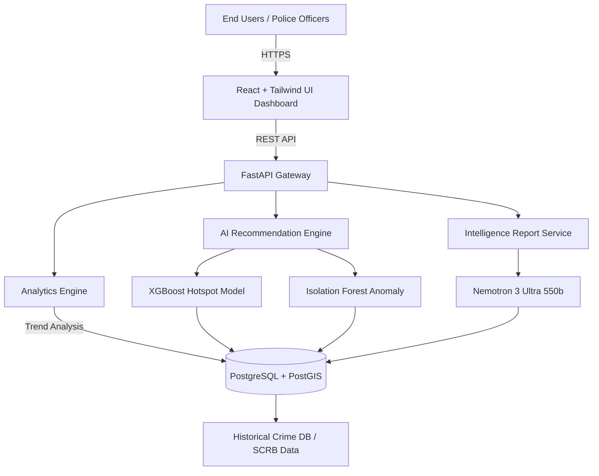
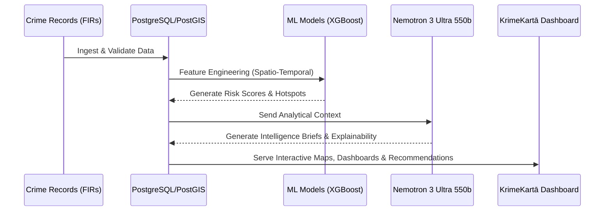

  
  
  

<h1 align="center">KrimeKartā 🛡️</h1>

<strong>AI-Powered Crime Intelligence & Patrol Decision Support Platform</strong>

  <em>Empowering law enforcement with explainable AI, geospatial intelligence, and predictive resource planning.</em>

---

## 🏆 Hackathon Details
- **Event**: Datathon 2026 (Organized by Karnataka State Police)
- **Challenge 02**: AI-Driven Crime Analytics & Visualization Platform
- **Objective**: Develop a modern AI-powered analytics platform to transform fragmented records into actionable intelligence.

## 👥 Team VibeSync
- **Vishal Lakshmikanthan** (Leader)
- **SNEHA C** (Member)

---

## 🚀 Live Deployment — Zoho Catalyst

KrimeKartā is fully deployed on **[Zoho Catalyst](https://catalyst.zoho.com/)** — Zoho's cloud serverless platform — using **AppSail** (for the Node.js backend) and **Web Client Hosting** (for the React frontend).

| Component | Live URL |
| :--- | :--- |
| 🌐 **Web App (Frontend)** | [https://krime-karta-60080181311.development.catalystserverless.in/app/index.html](https://krime-karta-60080181311.development.catalystserverless.in/app/index.html) |
| ⚙️ **Backend API (AppSail)** | [https://krimekarta-backend-50044361476.development.catalystappsail.in](https://krimekarta-backend-50044361476.development.catalystappsail.in) |
| 💓 **Health Check** | [/health](https://krimekarta-backend-50044361476.development.catalystappsail.in/health) |

### 🔐 Demo Login Credentials
| Field | Value |
| :--- | :--- |
| **Service ID** | `KA-P-12345` |
| **Password** | `password` |
| **OTP (2FA)** | `123456` |

### ☁️ Deployment Architecture on Zoho Catalyst
- **Frontend** → Deployed as a **Web Client** (static hosting of the Vite/React production build)
- **Backend** → Deployed as an **AppSail** service running **Node.js 24** with auto-install on startup
- **Environment** → Zoho Catalyst **Development** environment (`krime-karta-60080181311`)
- **Region** → Asia/Kolkata

> ⚠️ This is the **Development** environment. For production promotion, use "Deploy to Production" in the Catalyst Console.

---

## 📖 Executive Summary
KrimeKartā is an AI-driven Crime Intelligence Platform designed to assist law enforcement agencies in making faster, smarter, and data-driven operational decisions. Rather than attempting to predict crimes with certainty, the platform analyzes historical crime patterns, spatial trends, temporal behaviors, and criminal relationships to recommend proactive patrol deployment, identify emerging hotspots, detect unusual activity, and generate automated intelligence briefings.

## 🚨 The Problem
Police departments generate enormous amounts of crime-related data every day. However:
- Crime records remain fragmented across police stations.
- Detecting emerging crime hotspots requires manual analysis.
- Patrol allocation depends heavily on officer experience.
- Criminal relationship analysis is time-consuming.
- Current systems rely on siloed data and manual reporting, limiting advanced analytics and proactive policing capabilities.

---

## 🔬 Project Research & Dataset Collection
Our research focused on utilizing real-world data structures to train predictive and analytical models that address actual operational pain points in law enforcement.

**Data Synthesis & Sources:**
- **Karnataka SCRB Crime Reviews (Dec 2025 – Jun 2026):** Synthesized 7 monthly reviews.
- **Annual Crime Statistics (2025):** Including IPC (Indian Penal Code), SLL (Special and Local Laws), and Crimes against Women/Children/SC-ST.
- **Key Insights Derived:**
  - *Bengaluru City* accounts for 26% of State IPC Crime & 30% of Cyber Crime.
  - *Seasonal Homicide Surges* driven by land/civil disputes in summer months.
  - *Highway Fatalities* clustering around NH-44, NH-48, NH-75.
  - *Cyber Fraud Typologies* mapping investment and OTP fraud demographics.

---

## ⚙️ Tech Stack & Model Selection

### 🧠 Core AI/ML Model
- **Language Model**: **Nemotron 3 Ultra 550b** (Primary engine for generating AI Intelligence Briefings, explaining Hotspot logic, and natural language query processing).
- **Predictive ML**: XGBoost (Hotspot Prediction), Isolation Forest (Anomaly Detection), SHAP (Explainable AI).

### 💻 Platform Architecture
| Component | Technologies |
| :--- | :--- |
| **Frontend** | React 19, TypeScript, Tailwind CSS v4, Zustand, Leaflet (Maps), Recharts |
| **Backend** | FastAPI, Python, SQLAlchemy, Pydantic, JWT Auth |
| **Database** | PostgreSQL, PostGIS (Geospatial data) |
| **Graph DB** | NetworkX, Sigma.js (Criminal relationship mapping) |
| **DevOps** | Docker, Nginx, GitHub Actions |

---

## 🏛️ System Architecture

## 🔄 Data Flow Process

---

## 🎨 Prototype Showcase & Feature Explanations

Here is a visual walkthrough of the KrimeKartā platform based on our prototype implementation. 

### 1. Interactive Crime Intelligence Map & Dashboard
**File**: `prototype_screenshots/Screenshot 2026-07-26 113145.png`
 

**Explanation**: This section provides a unified geospatial view of all crime clusters across the state. Officers can use the interactive map (Leaflet + OpenStreetMap) to view district boundaries, pinpoint active hotspots, and visualize crime density heatmaps in real-time.

### 2. Crime Analytics & Trend Dashboards
**File**: `prototype_screenshots/Screenshot 2026-07-26 120428.png`
 

**Explanation**: A comprehensive analytics view showcasing key performance indicators (KPIs), temporal crime trends, district-level comparisons, and demographic distributions of incidents.

### 3. AI Patrol Recommendation Engine
**File**: `prototype_screenshots/Screenshot 2026-07-26 120441.png`
 

**Explanation**: The flagship feature of the system. It recommends areas requiring increased patrols and suggests the intensity (e.g., Mobile Units vs Foot Patrols). It uses predictive scoring based on historical spikes.

### 4. Explainable AI Risk Scoring
**File**: `prototype_screenshots/Screenshot 2026-07-26 120450.png`
 

**Explanation**: To build trust with law enforcement, every AI recommendation includes transparent reasoning via SHAP values. It tells the officer *why* a location is a hotspot (e.g., "Theft increased 34% + Weekend Activity + Near transport hub").

### 5. Criminal Network & Link Analysis
**File**: `prototype_screenshots/image.png`
 

**Explanation**: Graph visualizations of repeat offenders, syndicates, and co-accused relationships. This allows investigators to trace central figures in organized crime and track repeat offender associations.

### 6. Automated Intelligence Briefs (Powered by Nemotron 3 Ultra 550b)
**File**: `prototype_screenshots/Screenshot 2026-07-26 120503.png`
 

**Explanation**: Our integration of the Nemotron 3 Ultra 550b model automatically reads statistical data and produces comprehensive, human-readable executive summaries, threat matrices, and daily briefings.

### 7. Spatio-Temporal Crime Correlation
**File**: `prototype_screenshots/Screenshot 2026-07-26 120535.png`
 

**Explanation**: Identifying when and where crimes happen. This module visualizes peak crime hours, day-of-week trends, and helps optimize shift-based resource allocation.

### 8. Trend Alerts & Anomaly Detection
**File**: `prototype_screenshots/Screenshot 2026-07-26 120544.png`
 

**Explanation**: Powered by Isolation Forest algorithms, this section highlights unusual spikes in specific crimes (e.g., sudden surge in cyber frauds or highway accidents), triggering immediate alerts to administrators.

### 9. Data Ingestion & Incident Management
**File**: `prototype_screenshots/Screenshot 2026-07-26 120551.png`
 

**Explanation**: The portal for authorized personnel to input, validate, and manage FIR data, ensuring the system continually learns from the latest records.

### 10. Security & Role-Based Access Control (RBAC)
**File**: `prototype_screenshots/Screenshot 2026-07-26 120601.png`
 

**Explanation**: Ensuring enterprise-grade security. Different views and permissions are provided for State-level admins, District SPs, and Station House Officers, secured via JWT and HTTPS.

---

## 🌟 Why KrimeKartā Stands Out
- **Problem-First Approach:** Built specifically to solve the manual overhead and siloed data problems faced by the Karnataka State Police.
- **Explainable AI:** Does not operate as a "black box" - every insight is backed by transparent, historical evidence.
- **High-End Generative AI:** Uses the powerful **Nemotron 3 Ultra 550b** to produce actionable, human-like intelligence reports.
- **Production-Ready Architecture:** Designed with modern, scalable, open-source enterprise standards.

---
*Built with ❤️ for Datathon 2026*
