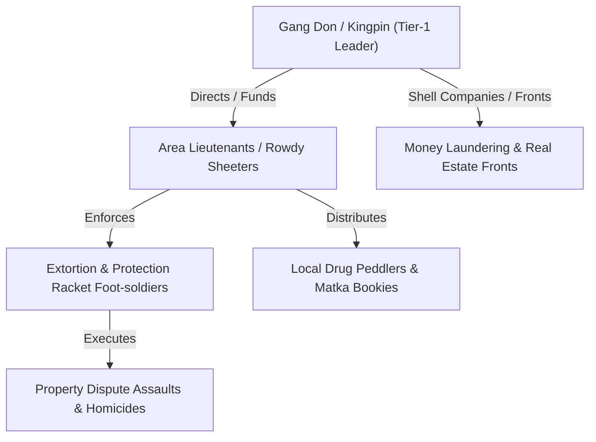

# 05 - Rowdies, Gangs, Dons & Organized Crime Intelligence

> **Document Path**: `crime_intelligence_docs/05_ROWDIES_GANGS_DONS_AND_ORGANIZED_CRIME.md`  
> **Target Component**: KrimeKartā Criminal Intelligence Directory & Network Graph Analyzer  
> **Source Records**: State Crime Records Bureau Preventive Action & Special Laws Reports (2025–2026)

---

## 1. Preventive Security Proceedings & Rowdy Sheet Monitoring

To maintain public order and prevent violent gang rivalries, Karnataka law enforcement executes preventive security proceedings against habitual offenders, rowdies, and criminal syndicate members under the Bharatiya Nagarik Suraksha Sanhita (BNSS).

### Preventive Security Proceedings Breakdown (June 2026 vs May 2026 vs June 2025)

| Preventive Action Head (BNSS) | Statutory Purpose & Target Group | June 2026 Cases | May 2026 Cases | June 2025 Cases | Monthly Trend & Enforcement Notes |
| :--- | :--- | :---: | :---: | :---: | :--- |
| **Sec. 126 BNSS** *(formerly CrPC 107)* | Security for keeping peace (Rowdy sheeters, political rivals, land agitators). | **2,501** | 3,384 | 3,000 | Heavy execution ahead of local body elections & festival processions. |
| **Sec. 128 BNSS** *(formerly CrPC 109)* | Security for good behavior from suspected persons / vagrants hiding presence. | **278** | 218 | 272 | Targeted at night prowlers, inter-district housebreaking suspects. |
| **Sec. 129 BNSS** *(formerly CrPC 110)* | Security for good behavior from habitual offenders (Hardcore rowdies, dacoits). | **2,358** | 2,275 | 1,230 | **+91.7% surge YoY** reflecting strict bond execution on active gang sheeters. |
| **Total Security Proceedings** | **Habitual Offender Bond Executions** | **5,137** | **5,877** | **4,502** | ~5,000 active rowdies & habitual offenders bound over monthly. |

---

## 2. Organized Crime Syndicates & Illegal Enterprise Matrix

In Karnataka, organized crime operates across four major illegal enterprise vectors:

```
                   KARNATAKA ORGANIZED CRIME ENTERPRISE VECTORS
                   
   +-----------------------+   +-----------------------+   +-----------------------+   +-----------------------+
   |   GAMBLING & MATKA    |   |    DRUG TRAFFICKING   |   |   ILLEGAL MINING      |   |   IMMORAL TRAFFIC     |
   | (KPA Sec 78, 79, 87)  |   |    (NDPS Cartels)     |   | (MMDR Act / KMMCR)    |   |     (ITP Act)         |
   | 1,264 Cases/Month     |   | 1,232 Cases/Month     |   | Sand & Mineral Gangs  |   | 50 Cases/Month        |
   +-----------------------+   +-----------------------+   +-----------------------+   +-----------------------+
```

### 1. Gambling & Matka Cartels (Karnataka Police Act)
- **Matka Gambling (Sec. 78 Class C)**: **512 cases in June 2026** (2,983 cases in 2025). Highly organized bookie networks operating Mumbai/Kalyan matka derivative bets across North Karnataka (Belagavi, Vijayapur, Bagalkot, Hubballi) and Bengaluru urban pockets.
- **Street & House Gambling (Sec. 87 / 79-80)**: **700 cases in June 2026**. Local gaming dens funding rowdy gang operations.

### 2. Drug Syndicates (NDPS Act)
- **Synthetics Syndicate**: MDMA, Meth, and Cocaine peddling networks operating in Bengaluru City and coastal educational hubs (Mangaluru/Udupi). Features foreign national ringleaders (Dons) managing local student sub-agents.
- **Cannabis / Ganja Syndicate**: Inter-state supply chains bringing commercial quantities from Andhra Pradesh/Odisha borders into central distribution hubs in Tumakuru and Bengaluru.

### 3. Illegal Mining & Sand Extortion Gangs (MMDR & KMMCR)
- Heavy concentration in **Raichur, Ballari, Vijayanagara, Chitradurga, Belagavi, and Dakshina Kannada river basins**.
- Operates via armed muscle men (rowdy sheeters) enforcing illegal sand extraction, fake mineral transit passes, and assault on revenue officials.

### 4. Immoral Trafficking Syndicates (ITP Act)
- **Organized Brothel Networks**: **40 organized cases** in June 2026 (127 cases in 2025). Commercial networks operating behind spa/massage parlor fronts, online escort portals, and cross-border human trafficking rings.

---

## 3. Criminal Hierarchy Graph Structure for KrimeKartā Platform

The `AdvancedNetworkIntelligenceAnalysis.jsx` module models criminal gangs into graph node-edge structures:



### Entity Node Schema & Risk Attributes:
- **Node ID**: Unique Criminal Record Identifier (e.g., `ROWDY-BLR-KPR-089`)
- **Offender Profile**: Name, Alias, Police Station Jurisdiction, Active Rowdy Sheet Status (A-Category / B-Category).
- **Centrality Score**: Degree of connectivity across FIR co-accused lists.
- **Affiliated Gang Nexus**: Known ties to historic crime syndicates, real estate extortion cartels, or rival outfits.
- **Current Legal Status**: Out on Bail, Absconding, Bound over under Sec 129 BNSS, Incarcerated in Central Prison.

---
*Proceed to Section 06 for Police Unit CCTNS Rankings, Vehicle Fleet Log Compliance, and SAKALA Citizen Service Efficiency.*
