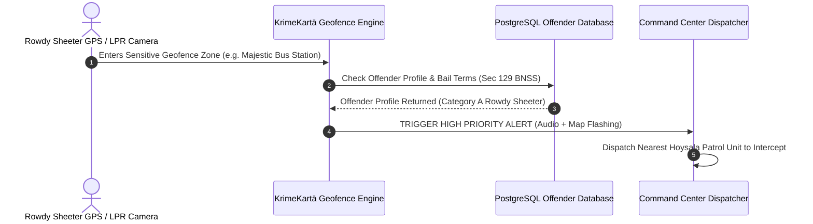

# 07 - Actionable Intelligence & Strategic Recommendations

> **Document Path**: `crime_intelligence_docs/07_ACTIONABLE_INTELLIGENCE_AND_STRATEGIC_RECOMMENDATIONS.md`  
> **Target Audience**: Command Officers, SPs, DSPs & KrimeKartā System Architects  
> **Objective**: Translating Empirical Karnataka Crime Intelligence into Platform Feature Engineering & Deployment Rules

---

## 1. Executive Intelligence Matrix for KrimeKartā Integration

To maximize operational value, empirical data from the 7 monthly State Crime Records Bureau reports (December 2025 – June 2026) must directly feed into KrimeKartā's core decision support engine:

```
+------------------------------------+------------------------------------+------------------------------------+
|  EMPIRICAL CRIME FINDINGS (SCRB)   |     POLICE OPERATIONAL NEED        |   KRIMEKARTĀ PLATFORM FEATURE      |
+------------------------------------+------------------------------------+------------------------------------+
| Bengaluru City accounts for 26% of | Targeted urban micro-patrolling &  | Dynamic Hexagonal Heatmap Grid     |
| state IPC crime & 30% of cyber.    | cyber fraud alert dispatch.        | in Geospatial Map (`Map.jsx`).     |
+------------------------------------+------------------------------------+------------------------------------+
| Summer Homicide Peak (+48.6% surge | Pre-emptive dispute intervention   | Predictive Threat Score Engine     |
| driven by land/civil disputes).    | in rural agrarian beats.           | in Analytics (`Analytics.jsx`).    |
+------------------------------------+------------------------------------+------------------------------------+
| 36% of road deaths occur on NHs    | Interceptor radar deployment on    | Highway Corridor Safety Geofence   |
| (885 deaths in June 2026 alone).   | NH-44, NH-48, NH-75.              | Rule Engine (`PatrolCenter.jsx`).  |
+------------------------------------+------------------------------------+------------------------------------+
| 5,137 rowdy/habitual offenders     | Real-time tracking of bond         | Rowdy Sheet Automated Alert        |
| bound over under Sec 126-129 BNSS. | expiration & bail violations.      | in Directory (`Directory.jsx`).    |
+------------------------------------+------------------------------------+------------------------------------+
| 579 Synthetic Drug cases / month   | Special intelligence watch on      | Syndicate Graph Centrality Index   |
| (MDMA/Cocaine in urban/coastal).   | foreign peddlers & student hubs.   | in Network View (`Network.jsx`).   |
+------------------------------------+------------------------------------+------------------------------------+
```

---

## 2. AI Patrol Deployment & Route Optimization Rules

The `AiPatrolRecommendationCenter.jsx` component should implement a 4-tier patrol optimization algorithm based on historical temporal-spatial crime density:

### Patrol Deployment Rules:

1. **Shift Schedule Calibration**:
   - **Night Shift (22:00 – 06:00)**: Prioritize **Burglary (Night House Breaking)** and **Highway Robbery** corridors (NH-48, NH-44). Deploy 60% of available mobile patrol cars (Hoysala / ERSS 112) along residential beats and national highway bypasses.
   - **Peak Hours (16:00 – 22:00)**: Prioritize **Motor Vehicle Theft** hotspots (commercial malls, metro stations, IT corridors in Whitefield/Electronic City) and **Street Gambling / Matka** dens.
   - **Day Shift (08:00 – 16:00)**: Prioritize **Cyber Crime awareness / Bank branch monitoring** and **SAKALA citizen service verification patrols**.

2. **Automated Risk Score Calculation Formula**:
   $$\text{Cell Risk Score} = (0.35 \times \text{Homicide/Violent Score}) + (0.25 \times \text{Property Crime Density}) + (0.20 \times \text{Active Rowdy Sheeters}) + (0.20 \times \text{Highway Crash History})$$

3. **Patrol Coverage Efficiency Metric**:
   - Aim for **< 8 minutes ERSS 112 response time** across urban commissionerates and **< 15 minutes** in range districts.

---

## 3. Automated Geofencing & Rowdy Sheet Alert Protocols

Within `GeospatialIntelligenceMap.jsx`, dynamic geofences should trigger real-time alerts on officer handheld terminals:



---

## 4. Strategic Recommendations for Law Enforcement Leadership

1. **Integrated CCTNS Auto-Sync**: Establish direct API webhooks between Karnataka Police CCTNS backend servers and KrimeKartā PostgreSQL database to eliminate manual CSV imports.
2. **Patrol Vehicle GPS Integration**: Link daily vehicle log entries (currently at ~37.6% logging rate) directly to KrimeKartā's live telemetry map, ensuring full fleet visibility for Superintendents of Police (SPs).
3. **Cyber Crime Financial Freeze Taskforce**: Automate 1930 Cyber Helpline freeze requests within the National Crime Records Database page (`NationalCrimeRecordsDatabase.jsx`) to halt online money transfer frauds within the golden hour.
4. **Inter-District Border Checkpost Network**: Enforce shared geofencing between border districts (e.g. Belagavi Dist – Maharashtra border; Bidar – Telangana border) to intercept inter-state gang movements.

---
*End of Documentation Series (`crime_intelligence_docs/`). All 8 modular files are saved and accessible in the project workspace.*
