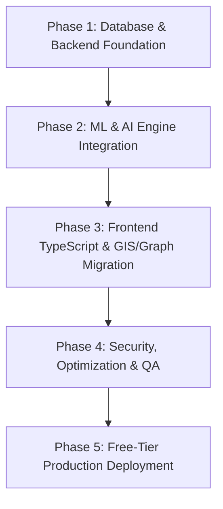

# KrimeKartā — Project Folder Analysis & Production Migration Strategy Report

## Executive Summary
This report presents a thorough architectural comparison between the **current KrimeKartā workspace prototype** and the target **KrimeKartā v2.0 Production Implementation Specification**. 

The current repository serves as a **Node.js/Express + React 19 JS rapid prototype** featuring mock datasets and basic route structures. To transition to a **production-grade, AI/ML-driven national crime intelligence platform**, the system must undergo a structured migration to a **Python FastAPI backend**, **PostgreSQL/PostGIS geospatial database**, **XGBoost/IsolationForest/NetworkX/SHAP ML pipeline**, and a **TypeScript-based React 19 frontend** integrated with **Leaflet** and **Sigma.js graph visualization**.

---

## 1. Codebase Gap & Delta Analysis

### 1.1 Backend Architecture Delta
| Component | Current Workspace State | Target Production Blueprint (v2.0) | Gap Assessment & Action |
| :--- | :--- | :--- | :--- |
| **Runtime & Framework** | Node.js Express ESM (`backend/src/server.js`) | Python 3.13 + FastAPI `0.115.x` | **Complete Re-architecture**: Migrate REST handlers from Express to FastAPI with async endpoints and Pydantic v2 validation. |
| **Database & Persistence** | In-memory JSON file store (`backend/data/store.json`) | PostgreSQL 16 + PostGIS + SQLAlchemy 2.0 ORM + Alembic | **Full Migration**: Implement PostGIS spatial tables for spatial crime geometries, indexing, and transactional integrity. |
| **Authentication & RBAC** | Basic JWT tokens via Express middleware | FastAPI OAuth2 Bearer with Passlib (Bcrypt) + Row Level Security (RLS) / Middleware RBAC | **Security Upgrade**: Introduce strict multi-tier RBAC (`FIELD_OFFICER`, `ANALYST`, `COMMANDER`, `SUPER_ADMIN`). |
| **Data Validation** | Minimal manual check in JS endpoints | Pydantic v2 schemas for request/response payloads | **Production Standards**: Define strict validation models for spatial points, criminal profiles, and ML input features. |

### 1.2 Intelligence & Machine Learning Engine Delta
| ML / AI Component | Current Workspace State | Target Production Blueprint (v2.0) | Implementation Strategy |
| :--- | :--- | :--- | :--- |
| **Hotspot Risk Scoring** | Static dummy risk ratings | **XGBoost 2.x** spatial-temporal risk scoring ($R = f(\text{spatial, temporal, environmental})$) | Implement feature engineering pipeline & model inference endpoint `/api/v1/ml/predict-hotspots`. |
| **Pattern Anomaly Engine** | Non-existent | **Isolation Forest** anomaly detector for surge detection | Train model on crime density metrics to trigger real-time anomaly alerts. |
| **Model Explainability** | None | **SHAP 0.46.x** tree explainer for local feature contributions | Expose top 3 risk factors per district/cell to ensure transparency in AI recommendations. |
| **Network Intelligence** | Hardcoded link arrays | **NetworkX 3.x** graph analysis (Degree, Betweenness, Eigenvector centrality) | Calculate central criminal nodes, syndicate bridges, and leadership ranking dynamically. |
| **AI Executive Briefing** | Pre-written text strings | **Gemini 2.0 Flash** via `google-generativeai` free tier | Generate automated district intelligence summaries from live database metrics. |

### 1.3 Frontend Delta
| Frontend Module | Current Workspace State | Target Production Blueprint (v2.0) | Upgrade Requirements |
| :--- | :--- | :--- | :--- |
| **Language & Typing** | React 19 JavaScript (`.jsx`) | React 19 + **TypeScript 5.x** (`.tsx`) | Convert components to strict TS, defining interfaces for Crime Records, Networks, and Patrol Routes. |
| **State Management** | Standard React `useState` & custom hook | **Zustand 5.x** (Global UI) + **TanStack Query 5.x** (Server cache) | Implement client state for filters/auth and automated background refetching/caching for geospatial layers. |
| **GIS Mapping** | HTML/Canvas mocks | **Leaflet 1.9** + **React-Leaflet 4.x** with GeoJSON heatmaps | Render real-time spatial heatmaps, patrol route polylines, and incident clusters using PostGIS GeoJSON endpoints. |
| **Graph Visualization** | Static layout components | **Sigma.js 3.x** + **Graphology 0.25.x** | Render interactive force-directed graph of criminal syndicates and associate relationships. |

---

## 2. Production Target Architecture & Directory Structure

To maintain clean separation of concerns and ensure seamless deployment on free-tier infrastructure (Supabase, Render, Vercel), the project will be structured as follows:

```
krime-karta/
├── docker-compose.yml              # Local multi-container orchestration (FastAPI + Postgres/PostGIS + Redis)
├── README.md
├── backend/                        # Python FastAPI Backend & ML Pipeline
│   ├── Dockerfile
│   ├── pyproject.toml / requirements.txt
│   ├── alembic.ini                 # DB Migration configuration
│   ├── alembic/                    # Migration scripts
│   ├── app/
│   │   ├── main.py                 # FastAPI entry point & CORS configuration
│   │   ├── config.py               # Pydantic BaseSettings (ENV vars)
│   │   ├── db/
│   │   │   ├── session.py          # SQLAlchemy async session setup
│   │   │   └── base.py             # ORM models registry
│   │   ├── models/                 # SQLAlchemy DB Models (PostGIS spatial tables)
│   │   │   ├── user.py
│   │   │   ├── crime_record.py
│   │   │   ├── criminal_entity.py
│   │   │   └── patrol_plan.py
│   │   ├── schemas/                # Pydantic v2 Request/Response Schemas
│   │   ├── api/v1/                 # REST API Router endpoints
│   │   │   ├── auth.py
│   │   │   ├── crimes.py
│   │   │   ├── intelligence.py
│   │   │   ├── ml.py
│   │   │   └── patrol.py
│   │   ├── services/               # Core Domain & AI/ML Services
│   │   │   ├── ml_hotspot.py       # XGBoost & Isolation Forest inference
│   │   │   ├── ml_shap.py          # SHAP feature importance calculation
│   │   │   ├── graph_service.py    # NetworkX centrality calculations
│   │   │   ├── gemini_service.py   # Gemini 2.0 Flash AI briefings
│   │   │   └── pdf_service.py      # WeasyPrint executive report generator
│   │   └── ml_models/              # Serialized ML artifacts (.joblib / .json)
│   └── tests/                      # Pytest suite
└── frontend/                       # React 19 + TypeScript Frontend
    ├── Dockerfile
    ├── package.json
    ├── tsconfig.json
    ├── vite.config.ts
    ├── src/
    │   ├── main.tsx
    │   ├── App.tsx
    │   ├── types/                  # TypeScript Data Interfaces
    │   ├── store/                  # Zustand state slices
    │   ├── services/               # TanStack Query API client calls
    │   ├── components/             # Reusable UI & Map/Graph Components
    │   │   ├── maps/               # Leaflet GIS Components
    │   │   ├── graphs/             # Sigma.js Syndicate Graph Components
    │   │   └── analytics/          # Recharts Components
    │   └── pages/                  # Operational View Components
```

---

## 3. Step-by-Step Migration & Build Roadmap



### Phase 1: Database & Backend Foundation (Hours 1–8)
1. **Supabase PostgreSQL + PostGIS Provisioning**:
   - Provision a free Supabase PostgreSQL instance and execute `CREATE EXTENSION IF NOT EXISTS postgis;`.
   - Setup Alembic migrations for tables: `users`, `crime_records`, `criminal_entities`, `network_edges`, and `patrol_plans`.
2. **FastAPI Modular Core**:
   - Initialize Python 3.13 project with FastAPI, SQLAlchemy 2.0, and Pydantic v2.
   - Build OAuth2 authentication with JWT access/refresh tokens and password hashing (`passlib[bcrypt]`).
   - Implement spatial CRUD REST endpoints returning GeoJSON FeatureCollections for Leaflet integration.

### Phase 2: Machine Learning & AI Engine Implementation (Hours 9–18)
1. **XGBoost & Isolation Forest Pipeline**:
   - Construct training/inference script (`app/services/ml_hotspot.py`) to process spatial-temporal feature matrices ($x, y, \text{hour}, \text{day\_of\_week}, \text{historical\_crime\_density}$).
   - Integrate Isolation Forest to identify anomalous crime spikes.
2. **SHAP Explainability Layer**:
   - Calculate SHAP values for predicted high-risk cells to output exact feature contributions (e.g., *+35% due to past 48h robbery cluster*, *+20% low lighting area*).
3. **NetworkX Graph Centrality Service**:
   - Build graph builder from `network_edges` table.
   - Run dynamic centrality algorithms (Betweenness, Degree, PageRank) to identify high-value targets and syndicate hubs.
4. **Gemini 2.0 Flash AI Briefings**:
   - Connect `google-generativeai` using free tier API key to summarize active hotspot clusters and generate operational directives for commanders.

### Phase 3: Frontend TypeScript & GIS/Graph Migration (Hours 19–28)
1. **TypeScript Infrastructure Setup**:
   - Configure `tsconfig.json` and convert core routes from JS to TS (`.tsx`).
   - Define strict TypeScript models matching Pydantic response contracts.
2. **State Layer Refactoring**:
   - Set up Zustand stores for active filters, user auth state, and selected entity drawers.
   - Wrap API calls in TanStack Query (`useQuery`, `useMutation`) for automatic caching and revalidation.
3. **Leaflet & Sigma.js Integration**:
   - Replace canvas/mock maps with `React-Leaflet` interactive maps displaying heatmap overlays, incident markers, and patrol polyline routes.
   - Replace static network renders with `Sigma.js` + `Graphology` for interactive criminal syndicate exploration.

### Phase 4: Testing, Security & Optimization (Hours 29–32)
1. **Security & RBAC Enforcement**:
   - Verify route guards on both frontend and backend for Role-Based Access Control.
   - Configure `cors` policies, `helmet` middleware equivalents, and rate limiting.
2. **Full QA & Static Validation**:
   - Execute backend test suite using `pytest`.
   - Run `oxlint` / `tsc --noEmit` on the frontend codebase.
   - Verify zero console errors and audit bundle sizes.

### Phase 5: Production Deployment Guide (Hours 33–36)
1. **Database**: Supabase free-tier PostgreSQL + PostGIS.
2. **Backend**: Render.com free Web Service (Dockerized FastAPI backend).
3. **Frontend**: Vercel CDN deployment (Automated CI/CD from main Git branch).
4. **Environment Variables Configured**:
   - `DATABASE_URL`: Supabase PostGIS connection string.
   - `GEMINI_API_KEY`: Free Google AI Studio API Key.
   - `JWT_SECRET`: Random 256-bit secret key.
   - `VITE_API_BASE_URL`: Render backend URL.

---

## 4. Verification & Readiness Summary

By following this production roadmap, **KrimeKartā** will transition from a lightweight prototype into a **robust, scalable, production-grade intelligence platform** meeting all requirements of the v2.0 Blueprint within a 36-hour hackathon execution schedule.
